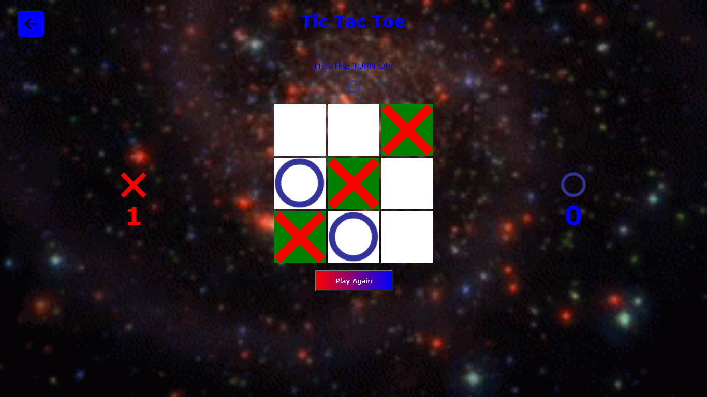

<h1 align='center'>Tic Tac Toe</h1>
<p>

  ## About
  
  <p>This is my representation of the famous tic tac toe game, built with javascript, html and css.</p>
  <b>Responsive</b>
</p>
<p>

  ## How to play
  
  ```shell
  
  cd 'your favorite repository'
  git clone https://github.com/JoseLucasapp/Tic-tac-toe-game
  cd Tic-tac-toe-game
  npm start
  
  ```
  
  <h3>NPM</h3>

  ```
  
  npm install
  npm start
  npm run dev

  ```
  
  <h3>YARN</h3>

  ```

  yarn
  yarn start
  yarn dev

  ```
</p>

<p>

  ## Used Tools
  
  <table>
    <tr>
      <td>Express</td>
      <td>EJS</td>
      <td>Consign</td>
    </tr>
  </table>
</p>

<p>

  ## Example
  
  
</p>

<p>

  ## Author
  
  <a href="https://www.instagram.com/jlucasgf/?hl=pt-br" style="text-decoration: none;">José Lucas Gonçalves Freitas</a>
</p>
